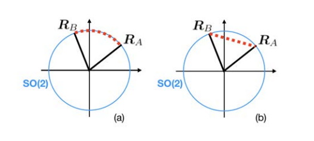

# 3D Geometric Basics

## Coordinate Frames

- robot `r`
- each sensor (e.g. camera frame `c`)
- world frame `w`
- external bodies (e.g. other robots, objects)

## Points, positions and translations

We represent the position of a 3D point `p` in the world frame using a 3D vector:

```math
p^w = \begin{bmatrix} p^w_x \\ p^w_y \\ p^w_z \end{bmatrix}
```

## Attitute and rotations

### Rotation matrix representation

- 2D rotation matrix

```math
R^W_T = \begin{bmatrix} cos(\theta) & -sin(\theta) \\ sin(\theta) & cos(\theta) \end{bmatrix}
```

- 3D rotation matrix

```math
R^W_T = \begin{bmatrix} x^W_r & y^W_r & z^W_r \end{bmatrix}
```

The matrix $R^W_T$ is called rotation matrix, it's not a generic matrix, since its columns represent orthogonal unit-length axis to satisfy the right-hand rule. Therefore, any rotation matrix has to satisfy:

- orthogonality (trực giao): the axes $x^W_r, y^W_r, z^W_r$ have unit length and are orthogonal to each other.
- right-handedness: the 3D axes satisfy the right-hand rule, which means $x^W_r \times y^W_r = z^W_r$, where $\times$ denotes the cross product between vectors.

#### Operations involving rotations

- Express points in a rotated frame: given the coordinates of a point $p^r$ in frame `r`, the following computes the coordinates $p^W$ in frame `w`

```math
p^W = R^W_rp^r
```

- Rotation composition: given the attitude of a frame `r` with respect to a frame `w` namely $R^W_r$, and the attitude of a frame `c` with respect to a frame `r` namely $R^r_c$, the attitude of the frame `c` with respect to the frame `w` is computed as follow:

```math
R^W_c = R^W_rR^r_c
```

- Inverse a rotation:

```math
R^r_W = (R^W_r)^{-1} = (R^W_r)^T
```

### Elementary rotations and Euler angles representation

- Theorem 1 (Euler's rotation theorem). Any rotation can be written as the product of no more than three elementaty rotations, where the elementary rotations are defined as follows:

```math
R_x(\phi) = \begin{bmatrix} 1 & 0 & 0 \\ 0 & cos(\phi) & -sin(\phi) \\ 0 & sin(\phi) & cos(\phi) \end{bmatrix}

R_y(\theta) = \begin{bmatrix} cos(\theta) & 0 & sin(\theta) \\ 0 & 1 & 0 \\ -sin(\theta) & 0 & cos(\theta) \end{bmatrix}

R_y(\psi) = \begin{bmatrix}  cos(\psi) & -sin(\psi) & 0\\ sin(\psi) & cos(\psi) & 0\\ 0 & 0 & 1 \end{bmatrix}
```

Therefore, one can parameterize the same rotation &R^W_r$ as:

```math
R^W_r = R_z(\psi)R_y(\theta)R_x(\phi)
```

where $\psi$ is called yaw angle, $\theta$ is called pitch angle and $\phi$ is called the roll angle.

The RPY has a singularuty for pitch angle equal to $\pi/2$. This singularity is called **Gimbal lock**.

### Axis-angle representation

- Theorem 2 (Euler's rotation theorem). Every rotation can be described as a rotation of an angle $\theta$ around an axis $u$ with $||u||=1$, not neccessarily assigned with the Cartesian axes. This suggests the axis-angle representations, which encodes a 3D rotation using the pair $(u, \theta)$.

#### Conversions

- From axis-angle to rotation matrix (**Rodrigues' rotation formula**):

```math
R^W_r = cos(\theta)I_3 + sin(\theta)[u]_{\times} + (1-cos(\theta))uu^T
```

where

```math
[u]_{\times} = \begin{bmatrix} 0 & -u_z & u_y \\ u_z & 0 & -u_x \\ -u_y & u_x & 0 \end{bmatrix}
```

is a skew symmetric matrix (the cross product matrix).

### Quaternion representation

If 3-parameter representations are ideal for storage (but have singularities and requires trigonometry), rotation matrices are singularity-free (but largely over-parametrize the attitude), W.R. Hamilton provided a solution called **quaternion** representation. Depending on the context, a quaternion is denoted as a column vector

```math
q = \begin{bmatrix} q_1 \\ q_2 \\ q_3 \\ q_4 \end{bmatrix}
```

or as an ipercomplex number

```math
q = iq_1 + jq_2 + kq_3 + q_4
```

with $i, j, k$ satisfying:

```math
i^2 = j^2 = k^2 = ijk = -1 \\
ij = -ji = k \\
jk = -kj = i \\
ki = -ik = j
```

The rotation matrix corresponding to a unit quaternion $q$ is given by:

```math
R(q) = \begin{bmatrix}
        q_1^2 - q_2^2 - q_3^2 + q_4^2   & 2(q_1q_2 - q_3q_4)                & 2(q_1q_3 + q_2q_4)            \\
        2(q_1q_2 + q_3q_4)              & -q_1^2 + q_2^2 - q_3^2 + q_4^2    & 2(q_2q_3 - q_1q_4)            \\
        2(q_1q_3 - q_2q_4)              & 2(q_2q_3 + q_1q_4)                & -q_1^2 - q_2^2 + q_3^2 + q_4^2\\
        \end{bmatrix}
```

## Poses and rigid-body transformations

If we call $t_r^W$ the position of the origin of $r$ (attached to a body) with respect to frame $W$, then the pair:

```math
(R_r^W, t_r^W)
```

fully characterizes the geometry of $r$ with respect to $W$, or the **pose** of $r$ with respect to $W$. A pose is fully defined by 6 parameters (3 for translation and 3 for attitude).

```math
T_r^W = \begin{bmatrix} R_r^W & t_r^W \\ 0_d^T & 1 \end{bmatrix}
```

where d = 2 in 2D problems and 3 in 3D.

### Rigid-body transformations.

Assumes we are given the coordinates $p^r$ of a point $p$, expressed in the reference frame $r$ and that we know the relative pose of the reference frame $r$ with respect to the frame $W$, namely $T_r^W$. Then the position of point $p$ with respect to the frame $W$ is given by:

```math
p^W = R_r^Wp^r + t_r^W
```

### Pose composition

Lets assume we are given the pose of a frame $r$ with respect to a frame $W$, namely $T_r^W$, and the pose of a frame $c$ with respect to a frame $r$, namely $T_c^r$. The pose of frame $c$ with respect to the frame $W$ is described as follow:

```math
T_c^W = T_c^WT_c^r
```

### Inverse of a pose

```math
T_W^r = (T_r^W)^{-1} = \begin{bmatrix} (R_r^W)^T & -(R_r^W)^Tt_r^W \\ 0_3^T & 1 \end{bmatrix}
```

# Lie Groups and Distances

## Groups and Lie Groups

A group $G$ is a set of elements together with a binary group operation $\otimes$ that satisfies the following conditions:

- closure: for any $A, B \in G$, it holds $A \otimes B \in G$
- associativity: for any $A, B, C \in G$, it holds $(A \otimes B) \otimes C = A \otimes (B \otimes C)$
- identity element: there exists an identity element $i \in G$ such that $A \otimes I = I \otimes A = A$ for any $A \in G$
- inverse: for any $A \in G$ there exist an inverse element $A^{-1}$ such that $A \otimes A^{-1} = A^{-1} \otimes A = I$

E.g.

- **General Linear Group** (GL$(d, \mathbb{R})$). Set of invertible $\mathbb{R}^{d \times d}$ matrix with matrix multiplication as group operation.
- **Orthogonal Group** ($O(d)$). Group of orthogonal matrices.
- **Special Orthogonal Group** ($SO(d)$). Group of rotation matrices, which is the subset of $d \times d$ matrices defined as $SO(d) \dot{=} \{R \in \mathbb{R}^{d×d} : R^TR = I_d, det(R) = +1 \}$. This is sometimes called the group of proper rotations.
- **Special Euclidean Group** ($SE(d)$). The group of $(d+1) \times (d+1)$ matrices representing rigid transformations.

## Lie algebras

Every matrix Lie group is associated a *Lie algebra*, which consists of a vector space, called *tangent space*, and a binary operation called the *Lie Bracket*.

E.g.

- Lie algebra of SO(3). The vector space corresponding to the Lie algrbra of SO(3) is

```math
SO(3) = \left\{
    \begin{bmatrix} 
    0 & -\phi_3 & \phi_2 \\
    \phi_3 & 0 & -\phi_1 \\
    -\phi_2 & \phi_1 & 0
    \end{bmatrix} 
    : \phi = \begin{bmatrix} \phi_1 & \phi_2 & \phi_3 \end{bmatrix} ^T \in \mathbb{R}^3
    \right\}
```
with corresponds to the set of skew-symmetric matrix in $\mathbb{R}^{3 \times 3}$. For notational convenience, we define the hat $(\cdot)^{\wedge}$ and the vee $(\cdot)^{\vee}$ operators as follows:

```math
(\phi)^{\wedge} \dot{=}
    \begin{bmatrix}
    0 & -\phi_3 & \phi_2 \\
    \phi_3 & 0 & -\phi_1 \\
    -\phi_2 & \phi_1 & 0
    \end{bmatrix}
    and 
    \begin{bmatrix}
    0 & -\phi_3 & \phi_2 \\
    \phi_3 & 0 & -\phi_1 \\
    -\phi_2 & \phi_1 & 0
    \end{bmatrix}^{\vee} \dot{=} \phi
```

- Lie algebra of SE(3). The vector space corresponding to the Lie algebra of SE(3) is:

```math
SE(3) = \left\{ 
    \begin{bmatrix}
    \phi^{\wedge} & \rho \\
    O_3^T & 0
    \end{bmatrix}
    : \rho, \phi \in \mathbb{R}^3
\right\}
```

For notational convenience, we overload the hat $(\cdot)^{\wedge}$ and the vee $(\cdot)^{\vee}$ operators to work on vectors $E \in \mathbb{R}^6$ as vectors:

```math
E^{\wedge} = \begin{bmatrix} \phi \\ \rho \end{bmatrix}^{\wedge} \dot{=} \begin{bmatrix} \phi^{\wedge} & \rho \\ O_3^T & 0 \end{bmatrix} and \begin{bmatrix} \phi^{\wedge} & \rho \\ O_3^T & 0 \end{bmatrix}^{\vee} \dot{=} E = \begin{bmatrix} \phi \\ \rho \end{bmatrix}
```

## Exponential and Logarithm map

The *exponential map* and the *logarithm map* relate elements of a matrix Lie group with elements in the corresponding Lie algebra. In particular, the *exponential map* produces a matrix Lie group element $G$ from a Lie algebra element $A \dot{=} a^{\wedge}$ via matrix exponential:

```math
G = exp(A) = \sum^{\infty}_{n=1}{\frac{(-1)^{n-1}}{n}(G - I)^n}
```

- Exponential and Logarithm maps for SO(3). Any element of SO(3) is a $3 \times 3$ skew symmetric matrix, and this allows simplifying the expression of the exponential map for SO(3), which can be written in closed-form as follows:

```math
R = exp(\phi^{\wedge}) = cos(||\phi||)I_3 + sin(||\phi||)\left[ \frac{\phi}{||\phi||} \right]_{\times} + (1-cos(||\phi||))\left( \frac{\phi}{||\phi||} \right)\left( \frac{\phi}{||\phi||} \right)^T
```

Now we observe that the expression above resembles the Rodrigue's rotation formula.

- Exponential and Logarithm maps for SE(3). Using the special structure of the $4 \times 4$ skew matrix in SE(3), we can simplify the expression of exponential map for SE(3), which can be written in closed-form as follows:

```math
E^{\wedge} = \begin{bmatrix} \phi \\ \rho \end{bmatrix}^{wedge} = log\left(\begin{bmatrix} R & t \\ O_3^T & 1 \end{bmatrix}\right) = \begin{bmatrix} \phi \\ J_l^{-1} (\phi)t \end{bmatrix}^{\wedge}
```

where $\phi = log(R)^{\vee}$. The inverse of the left Jacobian can be expressed in closed form as:

```math
J_l^{-1} (\phi) \dot{=} I_3 - \frac{1}{2}\phi^{\wedge} + \left( \frac{1}{||\phi||^2} - \frac{1 + cos(||\phi||)}{2||\phi||sin(||\phi||)} \right) \phi^{\wedge}\phi^{\wedge}
```

## Distances

### Distances between rotations

#### Angular (or geodesic) distance in SO(3)

An intuitive metric for the distance between two rotations $R_A$ and ${R_B}$ in SO(3) can be obtained by (i) computing the relative rotation $R_{AB} = R_A^TR_B$ and (ii) computing the rotation angle $\theta_{AB}$ of the rotation, (iii) taking the absolute value of the rotation angle.

```math
dist_\theta(R_A, R_B) = \left| arccos \left( \frac{tr(R_Z^TR_B) - 1}{2} \right) \right|
```

or it can also be written as

```math
dist_\theta(R_A, R_B) = ||log(R_A^TR_B)^{\vee}|| = ||log(R_B^TR_A)^{\vee}
```

Bi-invariance: for 3 rotations

```math
dist_\theta(R_A, R_B) = dist_\theta(R_CR_A, R_CR_B) = dist_\theta(R_AR_C, R_BR_C)
```

#### Chordal distance in SO(3)

```math
dist_c(R_x, R_B) = ||R_A - R_B||_F = ||R_B-R_A||_F
```

where $|| \cdot ||_F$ is the Frobenius norm

```math
||M||_F = \sqrt{\sum_{ij}M_{ij}^2} = \sqrt{tr(MM^T)}
```



#### Quaternion distance

```math
dist_q(q_A, q_B) = ||q_A - q_b|| = ||q_B - q_A||
```

# References

- Massachusetts Institute of Technology. (2020). MIT 16.485 Visual Navigation for Autonomous Vehicles—LecNotes02/03 [Lecture notes]. MIT OpenCourseWare. https://ocw.mit.edu/courses/16-485-visual-navigation-for-autonomous-vehicles-vnav-fall-2020/resources/mit16_485f20_lec02and03/
- Massachusetts Institute of Technology. (2020). MIT 16.485 Visual Navigation for Autonomous Vehicles—LecNotes04/05 [Lecture notes]. MIT OpenCourseWare. https://ocw.mit.edu/courses/16-485-visual-navigation-for-autonomous-vehicles-vnav-fall-2020/pages/lecture-notes/